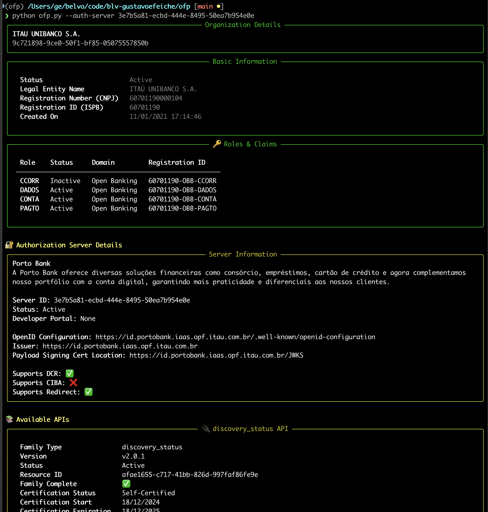

# Open Finance Participants CLI

A command-line tool to explore and debug Open Finance Participants information. Easily search for participants, check their roles, and inspect Authorization Server details.

## Requirements

- Python 3.13+
- uv (<https://docs.astral.sh/uv/>)

## Installation

1. Clone the repository:

```bash
   git clone https://github.com/blv-gustavoefeiche/ofp.git  
   cd ofp  
```

2. Create a virtual environment:

```bash
   uv venv
```

3. Install dependencies:

```bash
   uv sync
```

## Usage

### Basic Command Structure

```bash
   python ofp.py [OPTIONS]
```

Use `python ofp.py --help` to see all available options.

### Options

- `--search`: Search for participants by name, registration number, registration ID, or organization ID.
- `--role`: Filter participants by role (e.g., `DADOS`, `PAGTO`).
- `--auth-server`: Show detailed information for a specific Authorization Server.
- `--json`: Output raw JSON format.

---

## Example Commands

1. **List all participants** (will ask for confirmation):

```bash
   python ofp.py  
```

2. **Search by Organization Name** (fuzzy match):

```bash
   python ofp.py --search itau
```

3. **Search by Registration ID (ISPB)**:

```bash
   python ofp.py --search 60701190
```

4. **Search by Registration Number (CNPJ)**:

```bash
   python ofp.py --search 60701190000104
```

5. **Search by Organisation ID**:

```bash
   python ofp.py --search 9c721898-9ce0-50f1-bf85-05075557850b
```

6. **Filter by role**:

```bash
   python ofp.py --role DADOS
```

7. **Get detailed API information for a specific Authorization Server**:

```bash
   python ofp.py --auth-server 68308291-ec0d-4398-83ce-68b6b1087e49
```

8. **Get JSON output** (useful for scripting):

```bash
   python ofp.py --json  
```

## Output

The tool provides **formatted output** with the following details:

- **Organization Details**:
  - Basic information
  - Role Claims
- **Authorization Servers**:
  - Summary or detailed API information

### Example of output



## Tips

- Always try to use search to narrow down results.
- Use `--auth-server` when you need detailed API information.
- Use `--json` for programmatic access to the data.
